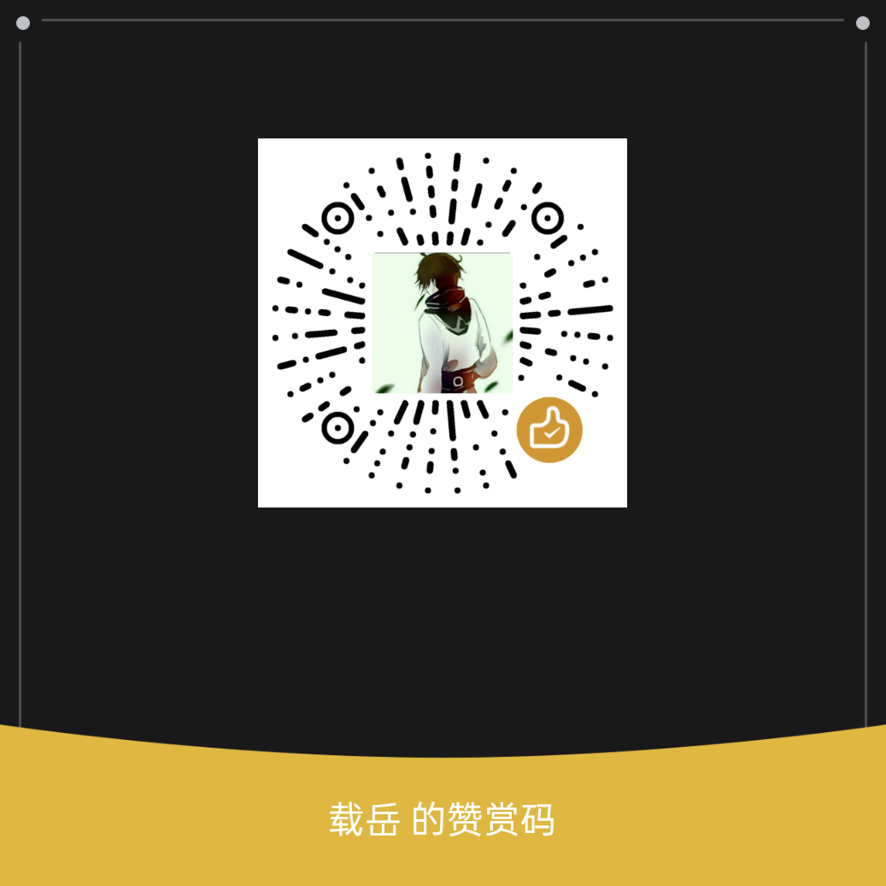

# 🚀 Antigravity Auto Accept | 自动授权神器
*(The Ultimate Permission Bypass / 终极权限放行插件)*

**Tired of Gemini Antigravity violently interrupting your workflow to ask for "Run" or "Allow" permissions?**  
Say no more. This extension is the **absolute ultimate, nuclear-grade** solution to completely bypass and automate every single permission prompt thrown your way by the IDE or other extensions.

> **受够了 Gemini Antigravity 动不动就弹窗打断您写代码，非要您手动点击「运行」或「允许」才能继续？**  
> 别再忍了。这个扩展是**最究极的、核武级别**的终极杀手锏，专门用来彻底绕过并全自动灭杀 IDE 或插件抛向您的任何权限确认弹窗。

---

## ✨ Why is it so powerful? | 为什么它如此强大？

VS Code and the Electron framework are notoriously difficult to automate due to their locked-down UI, shadow DOMs, and non-standard security layers. This extension doesn't just passively click; it employs a **4-Tiered Defense-in-Depth Matrix** to ensure that NO prompt survives longer than 1.5 seconds.

> VS Code 和底层的 Electron 框架因为对 UI 施加了严格锁定、使用了 Shadow DOM 以及非标准安全层，导致它们出了名的难以被外部自动化控制。但这个扩展绝不是简单的“模拟点击”——它部署了一套**四重深度防御矩阵 (4-Tiered Defense-in-Depth Matrix)**，确保没有任何一个弹窗能活过 1.5 秒。

### 🛡️ The 4-Tier Annihilation Protocol | 四重终极毁灭协议：

1. **The Phantom (VS Code Native Toast Poller)**
   *(Newest Weapon)* Electron Notification Toasts are essentially invisible to Windows OS-level tools. For this, we bypass the OS entirely and inject a constant Poller into VS Code's extension host. Every `500ms`, it blindly executes `vscode.commands.executeCommand('notifications.acceptPrimaryAction')`. If a toast exists, its primary button ("Run Alt+↵") is destroyed from the inside out.
   > **幻影 (原生 VS Code 轮询监听)：** *(最新武器)* Electron 的吐司通知气泡在 Windows 系统级工具眼里几乎是隐形的。为此，我们直接绕过操作系统，在 VS Code 扩展宿主内注入了一个不间断的轮询器。每 `500毫秒` 盲发一次原生指令。如果当时有弹窗，主按钮会被直接从内部瓦解。

2. **The Diplomat (UI Automation API)** 
   A lightweight, invisible PowerShell background process tirelessly scans the Windows OS UI tree for explicit confirmation semantics (`Allow`, `Approve`, `Run`) on standard windows and invokes them using standard .NET Event Triggers.
   > **外交官 (UI 自动化 API)：** 极轻量的隐形后台进程，无休止扫描 Windows 操作系统的 UI 树，寻找标准权限确认词（如 `许可`, `确认`, `Allow`），并用底层 .NET 事件静默触发。
   
3. **The Hacker (user32.dll Keyboard Injection + RuntimeId Cache)**
   If Electron attempts to swallow or ignore the API trigger, the script instantly drops to the native Windows C++ API (`user32.dll`), focuses the target, and violently injects a physical `Alt + Enter` keystroke directly into the operating system's event queue.  
   ***v1.2.0 Upgrade:*** To prevent aggressive scrolling from older chat history buttons, we implemented a strict `RuntimeId` HashSet cache. The script extracts the memory fingerprint of every button it kills and permanently blacklists it. Perfect silence.
   ***v1.3.4 Ghost Protocol Upgrade:*** Implemented a blazing fast `Stealth Focus Thievery` algorithm with built-in DVR active-window memory. If VS Code forcefully steals focus due to an error, or if a prompt appears while it's behind your browser, the script flashes the physical keystroke and instantly snaps focus back to your browser using its DVR memory.
   > **黑客 (底层键盘注入 + 内存指纹缓存)：** 如果 Electron 试图吞掉 API 触发，会瞬间降维调用 C++ API (`user32.dll`)，暴力向事件队列物理注入 `Alt + Enter` 键盘敲击。  
   > ***v1.2.0 史诗升级：*** 为防止扫描到聊天记录残留的旧按钮导致疯狂拉扯滚动条，引入严格的 `RuntimeId` 哈希缓存。提取被暗杀按钮的唯一指纹永久拉黑。
   > ***v1.3.4 幽灵协议升级 (Ghost Protocol DVR 录像机版)：*** 独创的 **后台前台状态记忆** 算法。哪怕您的 IDE 因为网络断开抛出红蓝按钮强行越狱把焦点抢到了您的游戏前面，脚本哪怕处于后台，也会瞬间连按重试，并在 **100毫秒** 内一脚把 IDE 踹回底层，将系统焦点完美还回给您的游戏/浏览器。快到肉眼甚至感觉不到任何中断！

   > ⚠️ **终极后台挂机姿势**：如果您把 IDE **完全点击最小化 (-) 缩进任务栏**，Chromium 会被强行挂起并断开无障碍树（所有的外挂自动化系统都会在“最小化状态”下眼瞎失效）。因此，正确的后台挂机姿势永远是：**让 IDE 平敞在桌面上，直接全屏打开您的浏览器、游戏或是看番神器死死盖住它。**得益于这个全新的 1.3.4 行车记录仪机制，它会全自动在层层叠叠的软件下方极速猎杀您的一切烦恼！
4. **The Encoder (Base64 UTF-16LE Execution)**
   *(Crucial Fix)* Native Windows `CreateProcess` calls from Node.js notoriously mangle strings on non-English locales. The extension compiles its script into a raw Base64 UTF-16LE binary payload and invokes PowerShell via `-EncodedCommand`. Path corruption is mathematically impossible.
   > **编码者 (Base64 UTF-16LE 执行防护)：** *(关键修复)* Node.js 在中文系统中极易引发乱码导致崩溃。扩展将后台脚本参数强制编译成最原始的 Base64 二进制载荷，以此跨越所有编码限制。从数学层面上断绝路径报错。

### 🔁 Bonus: Never Stop Generating | 附赠神技：永不断连
If Antigravity gets interrupted due to network timeouts and throws the dreaded red/blue **"Retry / 重试"** button, this extension's UIAutomation scanner will violently click it the exact millisecond it appears. Your AI agent essentially becomes immortal.
> 如果 Antigravity 因为网络波动中断生成，并抛出了崩溃的红蓝 **“Retry / 重试”** 按钮——本扩展会在它露头的第一毫秒极其暴力地将其按掉。让您的 AI 助手化身为不朽机器。

---

## ⚡ Installation & Usage | 安装与使用指南

### 0. Prerequisites / 前置需求
- **EN:** Only requires a **Windows OS** (Windows 10/11) because it uses the native `powershell.exe` shipped with Windows. **You DO NOT need to install the PowerShell VS Code extension.**
- **中:** 仅需 **Windows 操作系统** (Win 10/11)，因为本插件调用的是系统自带的底层 `powershell.exe`。**您完全不需要在 IDE 中安装任何 PowerShell 相关的扩展。**

### 1. Download / 下载扩展
- **EN:** Head over to the [Releases page](../../releases) and download the latest `antigravity-auto-accept-X.X.X.vsix`.
- **中:** 前往本仓库的 [Releases (发布页)](../../releases)，下载最新版的 `.vsix` 文件。

### 2. Install / 安装
- **EN:** Open VS Code/Antigravity and go to **Extensions** (`Ctrl+Shift+X`). Click the `...` menu at the top right, select **"Install from VSIX..."**, pick the file, and **restart your IDE**.
- **中:** 打开 IDE 进入 **扩展** 面板 (`Ctrl+Shift+X`)，点击右上角 `...` 图标。选择 **“从 VSIX 安装...”**，选中下载的文件。**极其重要：完成后务必重启 IDE！**

### 3. Usage / 如何使用
- **🤖 Zero Configuration / 零配置全自动:** 
  The extension is fully automatic. It activates entirely on its own the moment your IDE breathes. You don't need to do anything.
  > 本扩展完全免配置。您无需进行任何设置，只要 IDE 启动，影子杀手就会在后台自动部署猎杀网。
   
- **⏸️ Manual Toggle / 手动启停开关:** 
  If you ever need to pause the auto-clicker, press `F1` (or `Ctrl+Shift+P`) to open the Command Palette, and type:
  > 如需特殊暂停操作，请按 `F1` 或 `Ctrl+Shift+P` 呼出命令面板，输入如下命令：
   - `Antigravity Auto Accept: Start Auto-Clicker` (开启)
   - `Antigravity Auto Accept: Stop Auto-Clicker` (关闭)

---

## ☕ Support / 赞赏支持

**EN:** If this extension saved your sanity, your mouse, and your time, consider buying me a coffee! Your support fuels further development.
> **中:** 如果这个强力插件拯救了你的鼠标、你的时间，甚至治好了你的精神内耗，欢迎给作者投喂一杯咖啡！您的支持是我持续更新与硬核破解的最大动力！

  

---
*Built with pure rage against permission popups.* / *出于对权限弹窗的纯粹愤怒而开发。*
