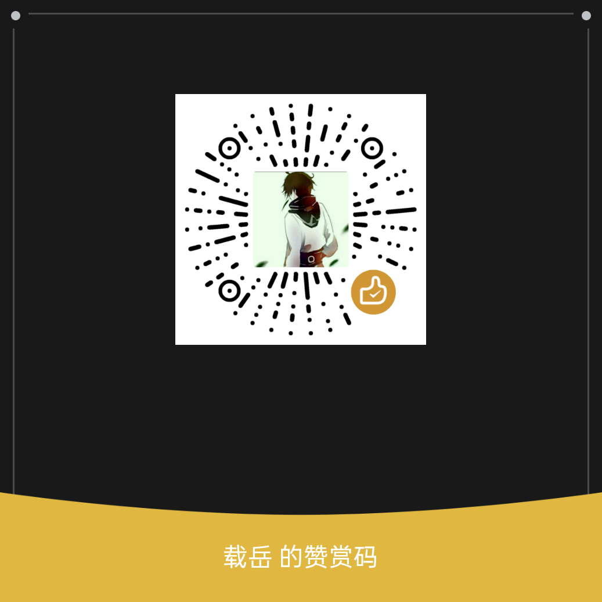

# 🚀 Antigravity Auto Accept v5.3.3

**Automatically accept supported agent approval buttons in Antigravity IDE on Windows.**
**Windows 上自动接受 Antigravity IDE 支持的 Agent 审批按钮，无需调试端口或命令白名单配置。**

[](LICENSE)
[](https://code.visualstudio.com/)
[](#)
[](#-remote-development-support--远程开发支持)

> **Tired of permission popups interrupting your AI workflow?**
> This extension starts automatically in a trusted Antigravity workspace and uses Windows UIAutomation to accept supported `Run`, `Accept`, and `Allow` buttons. No CDP port or executable patching is required.
>
> **受够了权限弹窗打断你的 AI 工作流？**
> 插件在可信的 Antigravity 工作区自动启动，通过 Windows UIAutomation 接受支持的 `Run`、`Accept`、`Allow` 等审批按钮。无需 CDP 端口，也不修改 IDE 程序。

## Native permissions and scope | 原生权限与适用范围

Antigravity's [IDE settings documentation](https://antigravity.google/docs/settings?tab=ide) describes terminal **Always Proceed**, with denylist exceptions. Native permission features differ by product and platform: [Antigravity 2.0 and Antigravity IDE have separate release tracks](https://antigravity.google/docs/changelog). If your installed version's native controls meet your needs, they may be sufficient.

官方 IDE 设置文档提供终端 **Always Proceed**；原生权限能力因产品、版本和平台而异，不能把 Antigravity 2.0 / CLI 的 Turbo 说明直接当成本机 IDE 2.5.5 已验证的设置。如果当前版本的原生设置已经满足需求，可以直接使用。这个扩展保留的价值是兼容仍显示审批按钮的工作流和旧版 IDE；本次实测的是 IDE 2.5.5 的一次允许审批卡片。

- Installation enables scanning by default; a **trusted workspace, local Windows host, and accessible IDE window** are required. The extension does not change the IDE's permission settings.
- **Strict Mode, explicit denials, enterprise policies, sandbox restrictions, and browser denylist entries remain enforced by Antigravity.** This is not a guarantee that every command can execute.
- Workspace trust prompts and generic `Save`, `OK`, `Yes`, or `Retry` buttons are not agent approvals and are excluded. English and Chinese approval labels are supported.
- Command permission cards select **Yes, allow this time** and submit the same card. Browser domain cards select **Allow Once**, including the menu inside **More actions** in a narrow sidebar. Command cards in the conversation or input area keep the same strict form checks; long cards scroll only the verified action control into view. The scanner does not select **Always Allow** or expand historical command records.
- `InvokePattern` can work without moving the cursor. Physical fallback only clicks when the target point still belongs to the verified Antigravity window; covered windows are skipped.
- One scanner covers the desktop session's Antigravity windows from the same installation path. Other enabled windows wait to take over. Stop disables this window's scanner; another enabled window may continue scanning, including buttons in the stopped window. Workspace trust gates the scanner's host; scanning is not isolated per workspace.

默认安装即启动扫描，但前提是可信工作区、本地 Windows 和可访问的 IDE 窗口。“零配置”指无需额外扫描器配置，不代表绕过所有权限。未针对每个 IDE 版本、远程环境和审批类型进行实机验证。

Current maintenance: **fhgffy**, with **Codex** assisting fixes and tests. See [CONTRIBUTING.md](CONTRIBUTING.md) to help maintain the project. Historical Git commit authorship is preserved.

Latest multi-window and CI verification: [docs/verification-2026-10-07.md](docs/verification-2026-10-07.md). Earlier runtime notes remain in [docs/verification-2026-10-05.md](docs/verification-2026-10-05.md). A result on one IDE version does not establish compatibility with every permission type or future release.

---

## ✨ How It Works | 工作原理

```
┌─────────────────────────────────────────────────┐
│  Extension Host (TypeScript)                    │
│  ┌───────────────────────────────────────┐      │
│  │ Spawns PowerShell background process  │      │
│  │ 500ms polling · 1500ms cooldown       │      │
│  └───────────────┬───────────────────────┘      │
│                  │ stdout                        │
│                  ▼                               │
│  Parse ___CLICK_INVOKE___ / ___CLICK_PHYSICAL___│
│  → Log to Output Channel                       │
└─────────────────────────────────────────────────┘

┌─────────────────────────────────────────────────┐
│  PowerShell (autoClicker.ps1)                   │
│                                                 │
│  1. Scan Chrome_WidgetWin_1 windows             │
│     → Verify the owning Antigravity executable │
│                                                 │
│  2. Find all Button controls (UIAutomation)     │
│     → Match supported agent approval labels    │
│       in English and Chinese                   │
│     → Exclude: Run and Debug, Run Task,         │
│       Always run, Run Extension, ...            │
│                                                 │
│  3. Click via InvokePattern (API-level)         │
│     → Fallback: user32.dll physical mouse click │
└─────────────────────────────────────────────────┘
```

### Two-Layer Click | 双层点击

| Layer | Mechanism |
|-------|-----------|
| **InvokePattern** (preferred) | UIAutomation API-level invocation. No cursor movement, no focus stealing. Silent and instant. |
| **Physical Click** (fallback) | Rechecks button state and the owning window at the target point before clicking. Skips covered windows and restores the cursor when configured. |

---

## 🌐 Remote Development Support | 远程开发支持

The extension declares `extensionKind: ["ui"]`, forcing it to **always run on your local Windows machine** — even in remote environments.

本插件声明 `extensionKind: ["ui"]`，**始终在本地 Windows 侧运行**。

| Environment | Status |
|-------------|--------|
| 🖥️ Local Windows | Supported scanner host; see verification notes for tested IDE versions |
| 🐧 Remote - WSL | Local UI extension design; remote end-to-end verification pending |
| 🔗 Remote - SSH | Local UI extension design; remote end-to-end verification pending |
| 📦 Remote - Container | Local UI extension design; remote end-to-end verification pending |

---

## ⚡ Installation | 安装

### Prerequisites | 前置需求

- **Windows 10/11** — Uses native `powershell.exe` and UIAutomation
- No CDP port, no additional setup | 无需 CDP 端口，无需额外配置

### Steps | 安装步骤

**方式一：插件商店搜索安装（推荐）**

在 VS Code / Antigravity 的扩展面板 (`Ctrl+Shift+X`) 中搜索 **`Antigravity Auto Accept`**（开发者: **fhgffy**），点击安装即可。

浏览器审批修复位于 **v5.3.1**，会话外终端审批与长表单滚动修复位于 **v5.3.2**，请核对商店显示的版本。若商店仍显示旧版本，请使用 GitHub Release 中对应版本的 VSIX。

- [VS Code Marketplace](https://marketplace.visualstudio.com/items?itemName=fhgffy.antigravity-auto-accept)
- [Open VSX Registry](https://open-vsx.org/extension/fhgffy/antigravity-auto-accept)

**方式二：下载 VSIX | 手动安装步骤**

1. **Download** the latest `.vsix` from the [Releases page](../../releases)
   从 [Releases 页面](../../releases) 下载最新 `.vsix` 文件

2. **Install** via `Ctrl+Shift+X` → `...` → **Install from VSIX...**
   通过扩展面板 → `...` → **从 VSIX 安装...**

3. Run **Developer: Reload Window** or restart the IDE | 执行 **Developer: Reload Window** 或**重启** IDE

> 💡 **Automatic startup** — Scanning starts automatically in a trusted Antigravity workspace. Windows permission and workspace trust choices remain yours.
> **自动启动** — 在可信 Antigravity 工作区自动扫描，系统权限与工作区信任仍由用户决定。

### Manual Toggle | 手动启停

Press `Ctrl+Shift+P` and type:
- `Start Antigravity Auto Accept` — 开启
- `Stop Antigravity Auto Accept` — 关闭
- `Toggle Antigravity Auto Accept ON/OFF` — 切换
- `Restart Antigravity Auto Accept Scanner` — 重启后台扫描器
- `Show Antigravity Auto Accept Logs` — 打开输出日志

### Optional Settings | 可选设置

The defaults still work with zero configuration. Advanced users can tune these in Settings:

默认仍然是零配置即用。需要微调时，可以在设置里修改：

| Setting | Default | Purpose |
|---------|---------|---------|
| `antigravityAutoAccept.autoStart` | `true` | Start scanning automatically when the extension activates |
| `antigravityAutoAccept.pollMs` | `500` | UIAutomation scan interval |
| `antigravityAutoAccept.cooldownMs` | `1500` | Minimum delay after an approval action attempt |
| `antigravityAutoAccept.restoreCursor` | `true` | Restore your mouse position after fallback physical clicks |
| `antigravityAutoAccept.showNotifications` | `false` | Show start/stop/restart notifications |

---

## 📋 Changelog | 更新日志

### v5.3.3 — Multi-window Reliability (2026-10-07)

- Rotate approval attempts across IDE windows so a busy first window does not delay others indefinitely.
- Isolate stale window/control failures, recheck action state after host lookups, and avoid a second physical click after an Invoke error.
- Keep the scanner running when notification preferences change; preserve a deliberate OFF during a workspace-trust transition.
- Validate both PowerShell engines, concurrent scanner ownership and handoff, source encoding, and VSIX contents in GitHub CI.
- Permission forms require a readable SelectionItem selection; unsupported legacy-only controls are skipped.

### v5.3.2 — Terminal Approval Form Placement (2026-10-06)

- Recognize dedicated command permission forms rendered outside the conversation.
- Scroll the verified one-time option and same-form Submit into view for long commands.
- Recheck the permission target, selection, form identity and owning host before acting; keep ordinary questions excluded.

### v5.3.1 — Browser Approval Cards (2026-10-06)

- Recognize the browser domain permission card and choose Allow Once.
- Handle the narrow sidebar where Allow Once is folded into More actions.
- Keep browser approval scoped to the active card and preserve command one-time approvals.

### v5.3.0 — Compatibility and Lifecycle Repair (2026-10-05)

- Support the current one-time permission card and its scoped Submit button; exclude completed Run tool records.
- Support the current `Antigravity IDE.exe` and legacy Antigravity host names; verify window process ownership.
- Repair stop/start races, cancel delayed restarts, and let waiting windows take over scanner ownership.
- Support Chinese approval labels; exclude generic dialog actions and allow negative multi-monitor coordinates.
- Verify the physical click target, handle hidden windows conservatively, and stop when the owning extension host exits.
- Add lifecycle and scanner regression tests, Windows CI, and public contributor instructions.
- Explain native Always Proceed and the limits of automatic approval.

### v5.2.0 — Safer Matching + Cleaner Controls (2026-07-28)

- 🛡️ **误点修复**：收紧前缀匹配边界，`Application Settings`、`Continuous Integration` 这类普通按钮不再被 `Apply` / `Continue` 误判
- 🖱️ **鼠标体验优化**：物理点击回退后默认恢复鼠标原位置，减少抢鼠标感
- ⚙️ **新增设置**：支持配置自动启动、扫描间隔、点击冷却、鼠标恢复和通知开关
- 🧭 **新增命令**：支持命令面板重启扫描器、打开扩展日志
- 🧪 **测试链修复**：`npm run lint` 不再依赖缺失的 ESLint，新增 PowerShell 匹配规则自测
- 🔒 **依赖清理**：移除 v5.0 CDP 实验遗留的 `ws` 依赖，`npm audit` 回到 0 漏洞

### v5.1.0 — Back to Basics: UIAutomation Revival (2026-03-29)

- 🔄 **架构回归**：从 CDP 方案回归 UIAutomation 直接按钮检测。UIAutomation 能看到 Antigravity 的权限按钮并支持 InvokePattern，无需 CDP 端口
- 🧹 **极简重写**：`extension.ts` 仅 ~150 行，`autoClicker.ps1` 仅 ~120 行。去除所有 Oracle/状态检测/指纹去重等复杂逻辑
- 🎯 **智能匹配**：前缀匹配 + 精确匹配 + 排除列表，覆盖 12 类权限关键词，排除 IDE 菜单误触
- ⚡ **双层点击**：优先 InvokePattern（无焦点抢占），失败时回退 user32.dll 物理点击
- 🔄 **Architecture revert**: Back to UIAutomation from CDP. UIAutomation can see Antigravity's permission buttons with InvokePattern support — no CDP port needed
- 🧹 **Minimal rewrite**: ~150 lines extension.ts, ~120 lines autoClicker.ps1. Removed Oracle/state detection/fingerprint dedup complexity
- 🎯 **Smart matching**: Prefix + exact match + exclusion list covering 12 permission keyword categories
- ⚡ **Two-layer click**: InvokePattern first (no focus stealing), user32.dll physical click fallback

### v5.0.0 — The CDP Experiment (2026-03-29)

- 🔧 **CDP 架构实验**：全面迁移到 Chrome DevTools Protocol，通过 WebSocket 连接 Antigravity 的 Chromium 调试端口，在 webview 内执行 JS 检测按钮 + `Input.dispatchMouseEvent` 模拟点击
- 📦 **新增模块**：`cdpClient.ts`（WebSocket CDP 客户端）、`buttonDetector.ts`（DOM 按钮扫描脚本）、`shortcutPatcher.ts`（自动修补快捷方式添加 `--remote-debugging-port=9222`）
- ❌ **已废弃**：确认 UIAutomation 仍能穿透最新版 Antigravity 后，v5.1.0 回归 UIAutomation
- 🔧 **CDP architecture experiment**: Full migration to Chrome DevTools Protocol — WebSocket connection to Chromium debug port, JS injection for button detection + `Input.dispatchMouseEvent` for clicks
- 📦 **New modules**: `cdpClient.ts`, `buttonDetector.ts`, `shortcutPatcher.ts`
- ❌ **Superseded**: Reverted to UIAutomation in v5.1.0 after confirming it still works with latest Antigravity

### v2.1.3 — Fingerprint Dedup: Click Once, Never Spam (2026-03-26)

- 🧠 **指纹去重缓存**：每个按钮点击后记录位置指纹（Name + X/Y 取整到 10px），同一按钮不再重复点击。解决 v2.1.2 Legacy 模式下疯狂点击历史 "Always run" 导致抢焦点的问题
- 🔄 **四态决策重构**：■ 运行中 → 全量点击（无需去重） | 错误面板 → 仅 Retry | Antigravity 空闲 → 去重点击 | 非 Antigravity → 全量 + 去重
- ⏱️ **TTL 自动清空**：指纹缓存 120 秒后自动清空，适应新一轮对话/UI 刷新
- 🧠 **Fingerprint dedup cache**: After clicking a button, records its position fingerprint (Name + X/Y rounded to 10px). Same button is never re-clicked
- 🔄 **Four-state logic**: ■ running → click all | error panel → Retry only | Antigravity idle → dedup click | non-Antigravity → click all + dedup
- ⏱️ **TTL auto-clear**: Fingerprint cache auto-clears every 120s for new conversations/UI refreshes

### v2.1.2 — Arrow Button False Positive Fix (2026-03-26)

- 🐛 **修复箭头按钮误判**：`Add context` / `Cancel` 等功能按钮的 CSS class 含 `opacity-70` + `rounded-full`，被误识别为聊天工具栏灰色箭头 → 所有权限按钮扫描被跳过
- 🔧 **修复方式**：灰色箭头判定增加 `Name 必须为空` 约束（真正的灰色箭头是纯图标无文字）
- 🐛 **Fix arrow button false positive**: `Add context` / `Cancel` buttons matched the gray arrow fingerprint — caused all permission button scanning to be skipped
- 🔧 **Fix**: Added `Name must be empty` constraint for gray arrow detection

### v2.1.1 — Universal Compatibility (2026-03-26)

- 🌍 **非 Antigravity IDE 回退**：检测到聊天工具栏（→ / ■）时使用 Oracle 智能模式；未检测到时（VS Code / Cursor / 其他 IDE）自动回退传统模式，盲点所有权限按钮
- 🌍 **Non-Antigravity fallback**: Oracle mode when chat toolbar detected; legacy mode for VS Code / Cursor / other IDEs — click all permission buttons unconditionally

---

## ⚠️ Pro Tip | 使用技巧

> **Don't minimize the IDE!** Chromium suspends the accessibility tree when minimized.
> Keep the IDE window available. API invocation may work in the background; physical fallback skips points covered by another app.
>
> **不要最小化 IDE！** Chromium 最小化后会断开无障碍树。
> 保持 IDE 窗口可访问。API 调用可能支持后台审批；物理点击回退会跳过被其它应用遮挡的目标。

---

## ☕ Support | 赞赏支持

If this extension saved your sanity and your mouse, consider buying me a coffee!
如果这个插件拯救了你的鼠标和精神状态，欢迎投喂一杯咖啡！

<p align="center">
  
</p>

---

<p align="center">
  <i>Built with pure rage against permission popups.</i><br>
  <i>出于对权限弹窗的纯粹愤怒而开发。</i>
</p>
